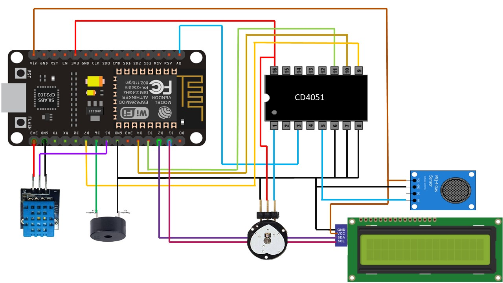

# Safety-Device-For-Mining-Workers-Using-IoT-


## Project Description

The Miners Safety Monitoring System is an embedded IoT solution designed to enhance the safety of miners by monitoring critical environmental parameters and vital signs. This system uses a combination of sensors and modules to measure gas concentration, pulse rate, temperature, and humidity levels. The data is displayed on an LCD screen and sent to a remote monitoring application using Blynk, enabling real-time alerts and data logging.

## Features

- **Gas Concentration Monitoring**: Measures the concentration of methane gas using an MQ-4 sensor and triggers a buzzer alarm if the levels exceed a safe threshold.
- **Pulse Rate Monitoring**: Continuously measures the miner's pulse rate using a pulse sensor and displays the data on an LCD screen.
- **Temperature and Humidity Monitoring**: Uses a DHT11 sensor to monitor the ambient temperature and humidity, displaying the values on the LCD and sending alerts if the temperature exceeds a set limit.
- **Remote Monitoring**: Integrates with Blynk for real-time data visualization and alerts on a mobile device.
- **LCD Display**: Provides an immediate visual indication of gas concentration, pulse rate, temperature, and humidity levels.

## Hardware Requirements

- NodeMCU (ESP8266)
- MQ-4 Gas Sensor
- Pulse Sensor
- DHT11 Temperature and Humidity Sensor
- Multiplexer
- LiquidCrystal I2C (16x2) LCD Display
- Buzzer
- Connecting wires and breadboard

## Software Requirements

- Arduino IDE
- Blynk Library
- PulseSensorPlayground Library
- DHT Sensor Library
- LiquidCrystal I2C Library

## Circuit Diagram



## Installation and Setup

1. **Clone the repository**:
    ```sh
    git clone [https://github.com/rdbhaiya/Safety-Device-For-Mining-Workers-Using-IoT.git](https://github.com/rdbhaiya/Safety-Device-For-Mining-Workers-Using-IoT-.git)
    ```

2. **Open the project in Arduino IDE**:
    ```sh
    File -> Open -> Select Miner-safety.ino
    ```

3. **Install required libraries**:
    - PulseSensorPlayground
    - DHT Sensor Library
    - LiquidCrystal I2C
    - Blynk

4. **Configure WiFi and Blynk credentials**:
    Update the following lines in the code with your WiFi SSID and password, and Blynk authentication token.
    ```cpp
    char ssid[] = "your_SSID";
    char pass[] = "your_PASSWORD";
    char auth[] = "your_BLYNK_AUTH_TOKEN";
    ```

5. **Upload the code** to the NodeMCU.

## Usage

1. Power on the system by connecting the NodeMCU to a power source.
2. The system will initialize and start monitoring the sensors.
3. View the real-time data on the LCD display.
4. Use the Blynk app to monitor the data remotely and receive alerts.

## Code Overview

### Libraries

- `PulseSensorPlayground.h`: For pulse sensor functionality.
- `Wire.h` and `LiquidCrystal_I2C.h`: For LCD display control.
- `DHT.h`: For DHT11 sensor functionality.
- `ESP8266WiFi.h` and `BlynkSimpleEsp8266.h`: For WiFi and Blynk connectivity.

### Setup

- Initializes the sensors, LCD display, and WiFi connection.
- Sets the pin modes for the multiplexer, control pins, and buzzer.

### Loop

- Reads data from the gas sensor, pulse sensor, and DHT sensor.
- Displays the data on the LCD and sends it to the Blynk app.
- Triggers the buzzer if the gas concentration or temperature exceeds the safe threshold.

### Functions

- `readGasSensor()`: Handles the gas sensor data reading, processing, and alerting.
- `readPulseSensor()`: Handles the pulse sensor data reading and averaging.
- `readDHTSensor()`: Handles the temperature and humidity data reading and alerting.

## Contributing

Contributions are welcome! Please fork the repository and submit a pull request for any enhancements or bug fixes.


## Acknowledgments

- Thanks to the developers of the libraries used in this project.
- Special thanks to the Blynk team for providing the platform for remote monitoring.
